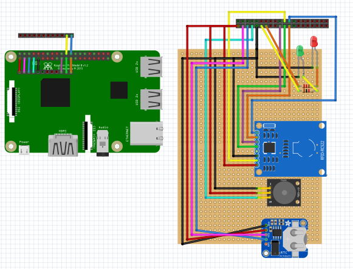

# checkin-system

over-engineered checkin-system that can be deployed to a raspberry pi.


## Hardware

The system uses a rasperry pi with a custom shield to read RFID tokens
and provide visual and acoustic feedback.

### Building the raspi shield

For the shield the following parts are needed:

#### parts list

| part                       | description                             | link                                        |
| -------------------------- | --------------------------------------- | ------------------------------------------- |
| RC522 RFID Reader module   | module to read ids from cards or tokens | https://www.amazon.de/gp/product/B01M28JAAZ |
| PCF8523 RTC module         | module to record correct timestamps     | https://www.amazon.de/gp/product/B07LGTX8M9 |
| KY-012 active piezo buzzer | acoustic feedback after rfid read       | https://www.amazon.de/gp/product/B07ZYVH6XM |
| green/red LED              | visual feedback after rfid read         |                                             |
| 2 resistors                | needed for LED circuits                 |                                             |

#### Schematic

The shield can be build based on the following schematic:



Download the [Fritzing File](raspi/fritzing/rfid_reader.fzz).

### Install and configure the raspi

#### DietPi

The easiest way to install and configure a raspi is by using DietPi.

1. Download DietPi Image from https://dietpi.com/#download
2. Flash `DietPi_RPi-ARMv8-Bookworm.img` to SD card
3. Patch the image `./dietpi-patch.sh <folder-where-sd-card-is-mounted-to>`

#### Manual

When installing a different distribution on the Raspi, the following steps
describe the steps needed to get everything running.

Install dependencies:

```
sudo apt-get update
sudo apt-get upgrade

sudo apt-get install build-essential git python3-dev python3-pip python3-smbus i2c-tools
sudo pip3 install spidev mfrc522
```

Configure interfaces:

```
sudo raspi-config
```

- [enable spi interface](https://www.raspberrypi-spy.co.uk/2014/08/enabling-the-spi-interface-on-the-raspberry-pi/)
- [enable i2c interface](https://www.raspberrypi-spy.co.uk/2014/11/enabling-the-i2c-interface-on-the-raspberry-pi/)

Install docker:

```
curl -fsSL https://get.docker.com -o get-docker.sh
sudo sh get-docker.sh

sudo usermod -aG docker $USER
newgrp docker

sudo pip3 install docker-compose
```

## Software

The software consists of the following parts:

- postgres database for persistence
- backend that is attached to the database and provides rest and websocket api
- frontend for the application, which talks via rest,websocket with the backend
- python script to interact with the raspi-shield and send rfid reading to the backend

The software can be installed via [Docker Compose](docker-compose.yml).

### installation

```shell
# clone the repository
git clone https://github.com/d-rk/checkin-system.git

# change to the repo dir
cd checkin-system

# build images yourself
docker-compose build --pull

# or pull them
docker-compose pull

# bring up the containers
docker-compose up -d
```

The frontend will then be accessible under http://localhost:3000/

## development

this chapter discribes steps needed when developing the software.

### local dev environment setup

1. Create a postgres in docker:

```
docker run --name postgres \
    -e POSTGRES_USER=postgres \
    -e POSTGRES_PASSWORD=postgres \
    -e POSTGRES_DB=checkin-system \
    -p 5432:5432 -d postgres
```

2. Create an `.env` file for the backend

```
cat > backend/.env <<- EOM
DB_HOST=127.0.0.1
DB_DRIVER=postgres
DB_USER=postgres
DB_PASSWORD=postgres
DB_NAME=checkin-system
DB_PORT=5432
DB_SSL_MODE=disable

CORS_ALLOWED_ORIGINS=*

# days after which checkIn will be deleted
CHECKIN_RETENTION_DAYS=100

# secret to sign bearer tokens with
API_SECRET=yoursecretstring

# token expiry duration
TOKEN_EXPIRY_HOURS=1

# password for initial admin account
ADMIN_PASSWORD=secret
EOM
```

3. Run backend

```
cd backend
go run ./...
```

4. Create an `.env` file for the frontend

```
cat > frontend/.env <<- EOM
VITE_API_BASE_URL=http://localhost:8080
# optional admin credentials for auto login 
VITE_ADMIN_USER=admin
VITE_ADMIN_PASSWORD=secret
EOM
```

5. Run frontend

```
cd frontend
npm start
```

### build/publish docker images

on an arm64 machine clone the repo an run:

```shell
# build
git pull
docker-compose build --pull

# login to quay.io / user-settings / Generate Encrypted Password
export QUAY_IO_PASSWORD=xxx
echo $QUAY_IO_PASSWORD | docker login -u d_rk --password-stdin quay.io

# push
docker-compose push
```
