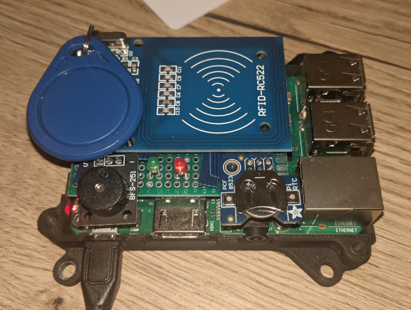

# checkin-system

over-engineered checkin-system that can be deployed to a raspberry pi.



## installation

### run in docker

```shell
docker-compose build
docker-compose up -d
```

The frontend will then be accessible under http://localhost:3000/

### run manually

1. Create a postgres in docker:

```
docker run --name postgres \
    -e POSTGRES_USER=postgres \
    -e POSTGRES_PASSWORD=postgres \
    -e POSTGRES_DB=checkin-system \
    -p 5432:5432 -d postgres
```

2. Create an `.env` file for the backend

```
cat > backend/.env <<- EOM
DB_HOST=127.0.0.1
DB_DRIVER=postgres
DB_USER=postgres
DB_PASSWORD=postgres
DB_NAME=checkin-system
DB_PORT=5432
DB_SSL_MODE=disable

CORS_ALLOWED_ORIGINS=*
EOM
```

3. Run backend

```
cd backend
go run .
```

4. Run frontend

```
cd frontend
npm start
```
